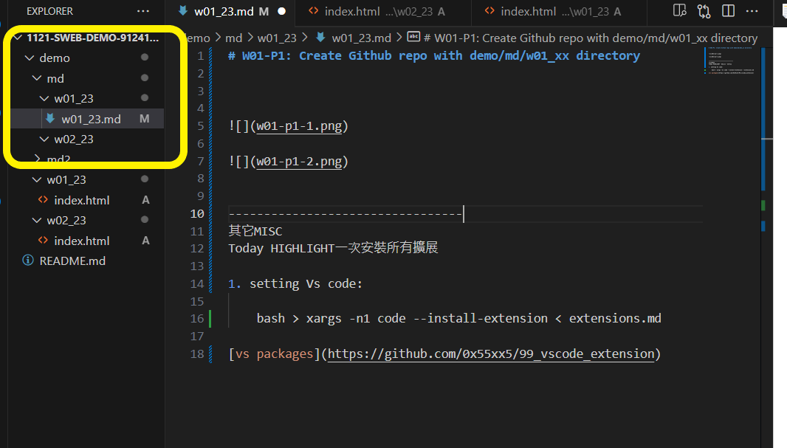
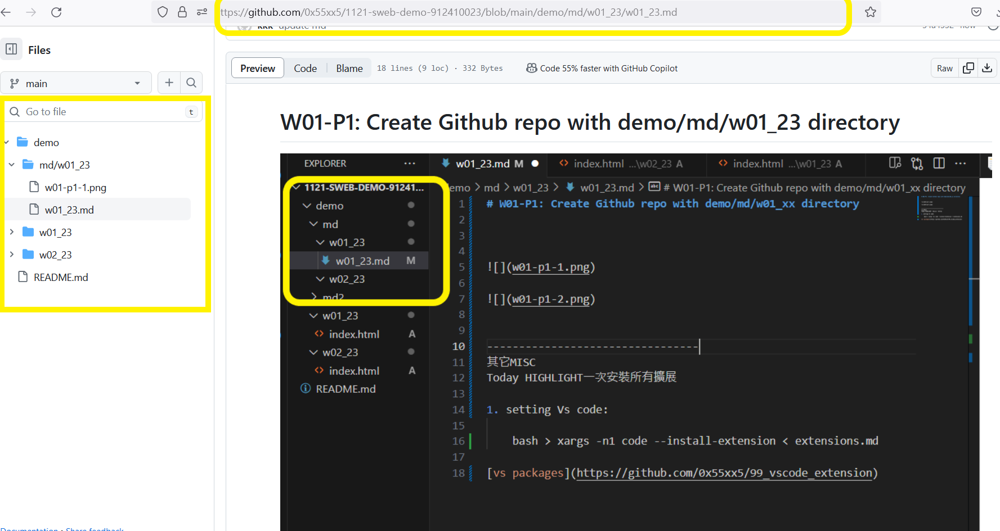

[My github repo url 912410023](https://github.com/0x55xx5)

# W01-P1: Create Github repo with demo/md/w01_23 directory

---------------------------------

在家方便安裝使用
上課過程其它查詢
其它MISC
Today HIGHLIGHT一次安裝所有擴展

1. setting Vs code:

    bash > xargs -n1 code --install-extension < extensions.md

[vs packages](https://github.com/0x55xx5/99_vscode_extension)