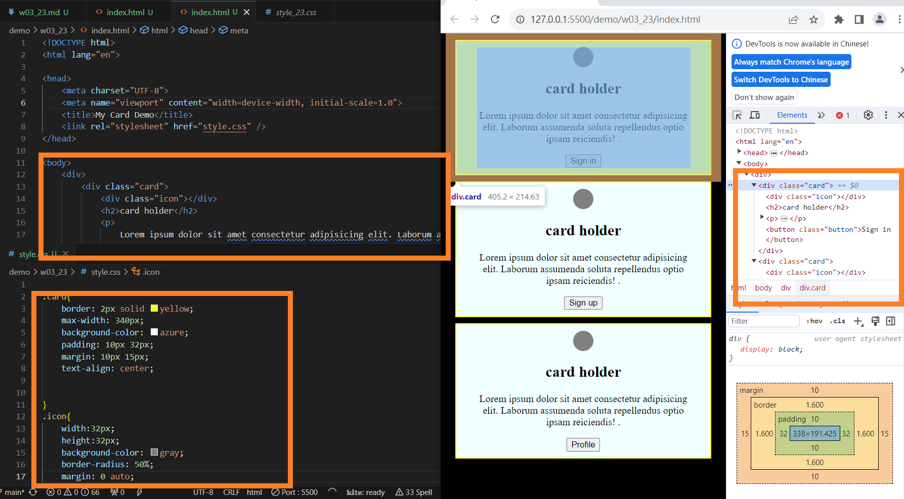

[My github repo url 912410023](https://github.com/0x55xx5)

#### 分支 MAIN

### W03-P1: W03-P1:Card demo using .card and .icon for common properties~~



### W03-P2:Card demo using .card-1, .card-2, .btn-1, .btn-2 for specific properties


--

```
    git log --pretty=format:"%h%x09%an%x09%ad%x09%s" --after="2023-09-27"

```

MISC
在這個指令中，%h%x09%an%x09%ad%x09%s 是一個自定義的格式，它包含了以下的欄位：

%h: 簡短的 commit hash
%x09: 一個 tab 字元
%an: 作者名稱
%x09: 一個 tab 字元
%ad: 作者提交日期
%x09: 一個 tab 字元
%s: 提交訊息

```
26cb78f 912410023 Thu Sep 28 19:17:46 2023 +0800 W03-P1:Card demo using .card and .icon for common properties~~
```

--

### 本周(第三周)
