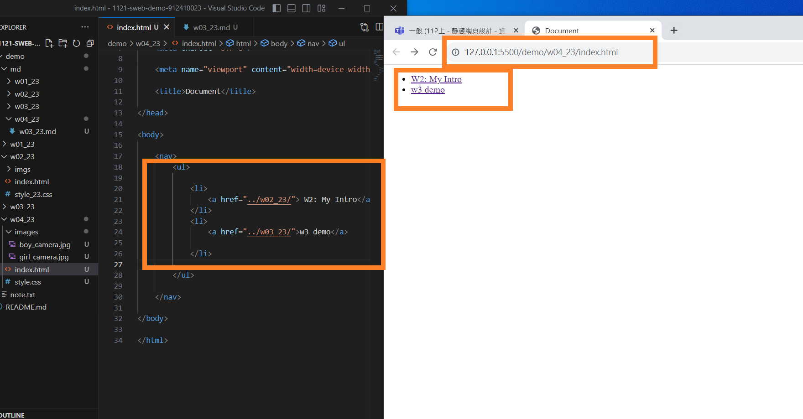
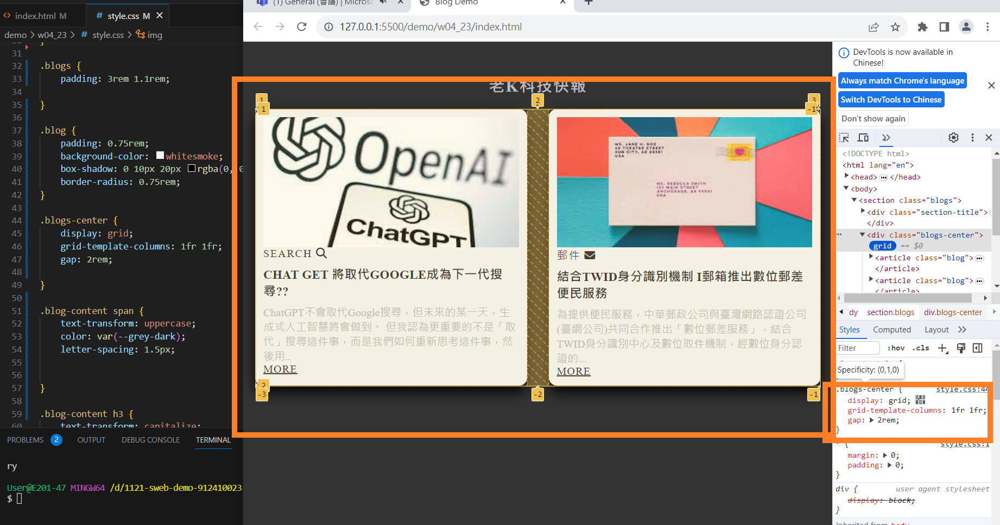
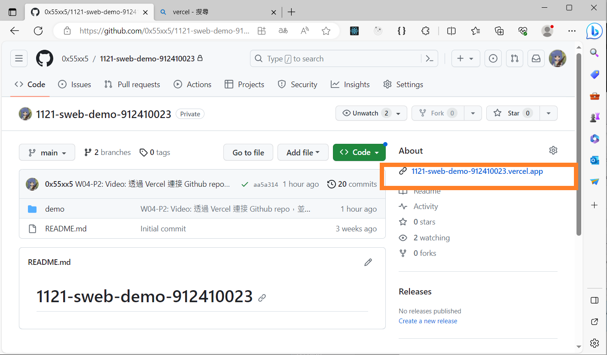
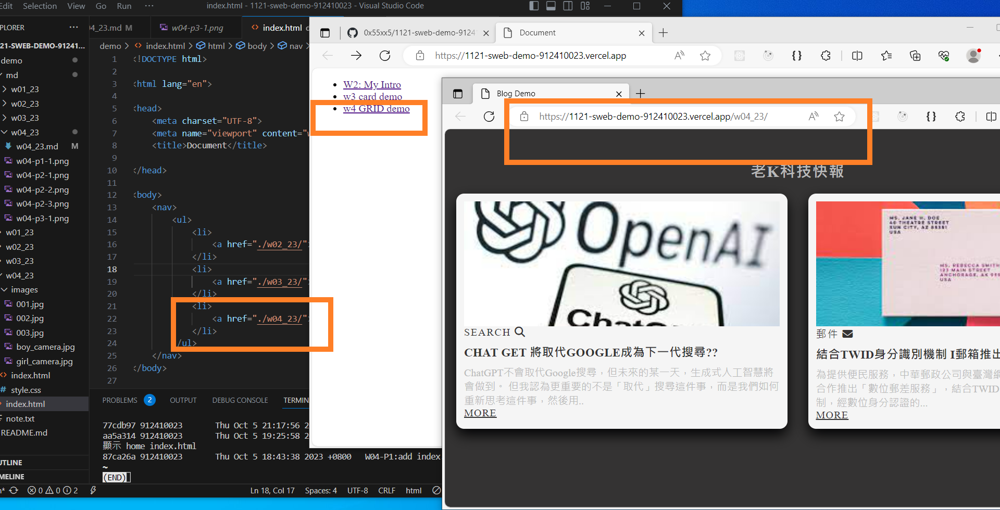

[My github repo url 912410023](https://github.com/0x55xx5)

[My Vercel url 912410023](https://1121-sweb-demo-912410023.vercel.app/)

#### 分支 MAIN

### W04-P1: W04-P1:add index.html in week4's home directory



```
87ca26a 912410023       Thu Oct 5 18:43:38 2023 +0800   W04-P1:add index.html in week4\'s home directory

```

### W04-P2: Video: 透過 Vercel 連接 Github repo，並顯示 home index.html


```
aa5a314 912410023       Thu Oct 5 19:25:58 2023 +0800   W04-P2: Video: 透過 Vercel 連接 Github repo，並顯示 home index.html
```

### W04-P2: Use css grid for two blogs locally



```
77cdb97 912410023       Thu Oct 5 21:17:56 2023 +0800   W04-P2: Use css grid for two blogs locally

```

### W04-P3: Show w4 p2 in Vercel





### W04-O4: W4 git logs
