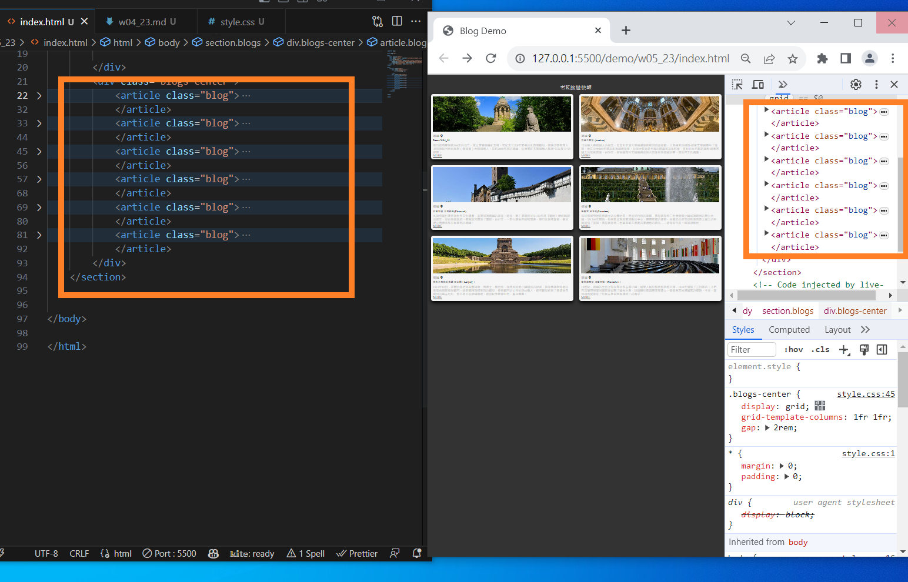
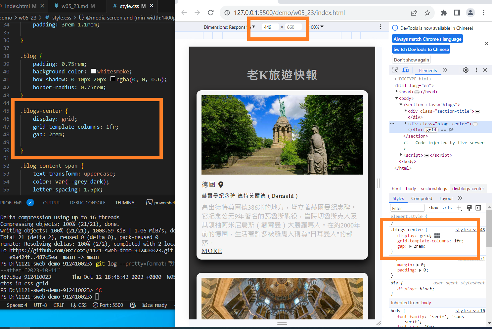
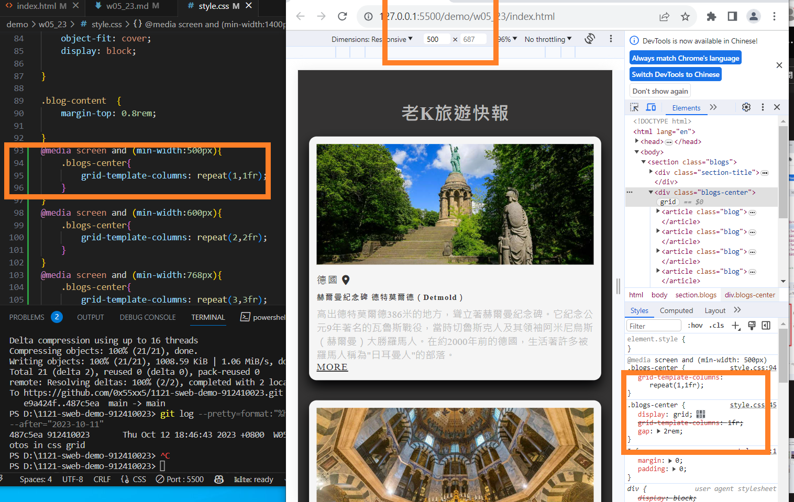
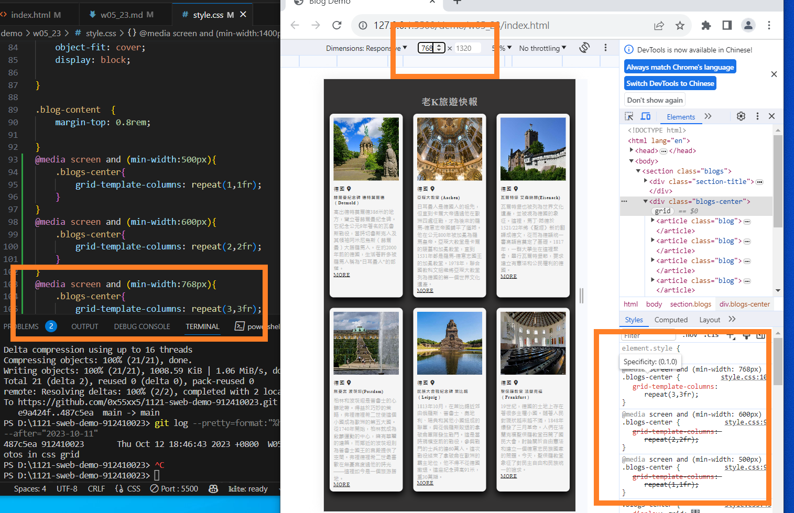
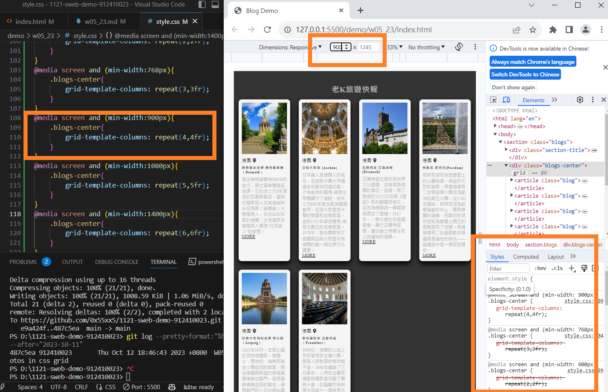
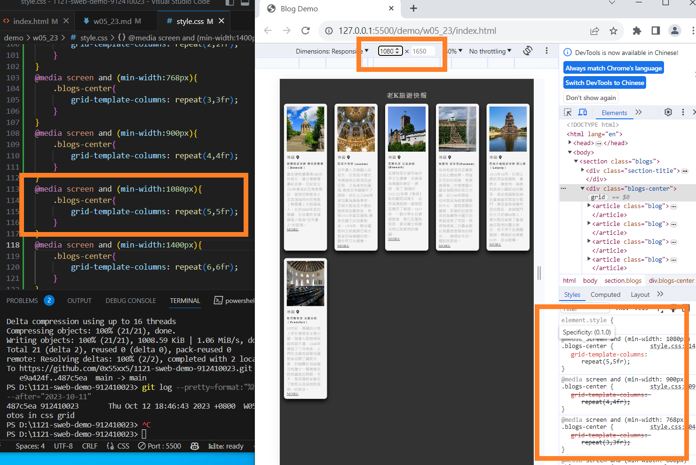
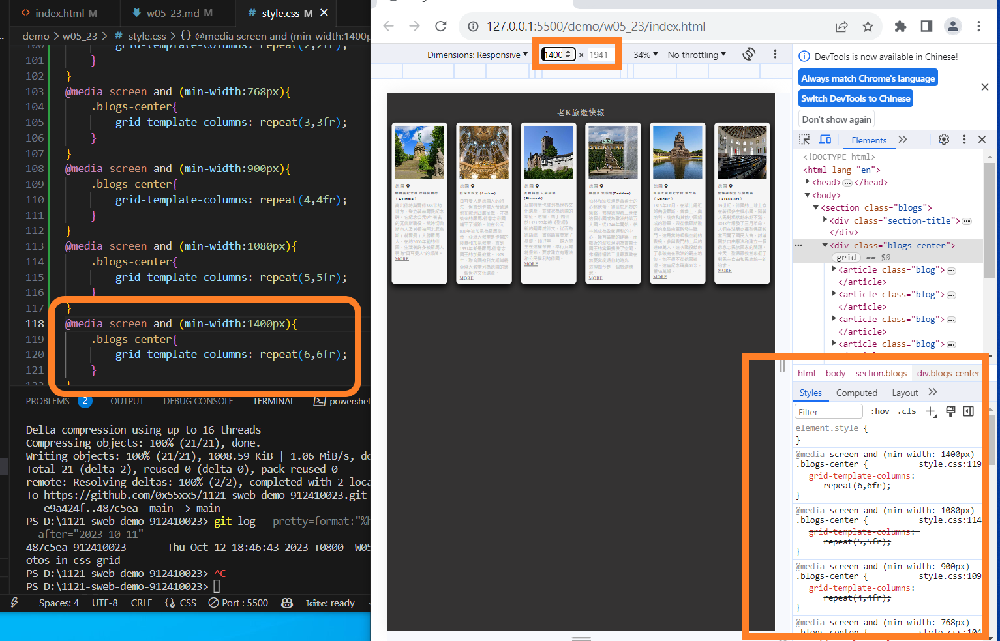
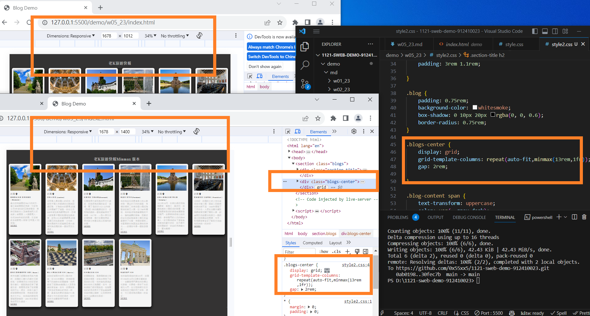

[My github repo url 912410023](https://github.com/0x55xx5)

[My Vercel url 912410023](https://1121-sweb-demo-912410023.vercel.app/)

#### 分支 MAIN

### RWD 手做

### W05-P1: W05-P1: Show 6 photos in css grid



```
487c5ea 912410023       Thu Oct 12 18:46:43 2023 +0800  W05-P1: W05-P1: Show 6 photos in css grid

```

### W05-P2: Use RWD breakpoints to show blogs









```
67c28dc 912410023       Thu Oct 12 19:58:14 2023 +0800  W05-P2: Use RWD breakpoints to show blogs

```

### W05-P3: xxxxxxxxxxxxx




### W05-O4: xxx

```
0e0047b 912410023       Thu Oct 5 21:23:52 2023 +0800   W05-P3: Show w4 p2 in Vercel
77cdb97 912410023       Thu Oct 5 21:17:56 2023 +0800   W05-P2: Use css grid for two blogs locally
aa5a314 912410023       Thu Oct 5 19:25:58 2023 +0800   W05-P2: Video: 透過 Vercel 連接 Github repo，並
顯示 home index.html
87ca26a 912410023       Thu Oct 5 18:43:38 2023 +0800   W05-P1:add index.html in week4\'s home directory

```
