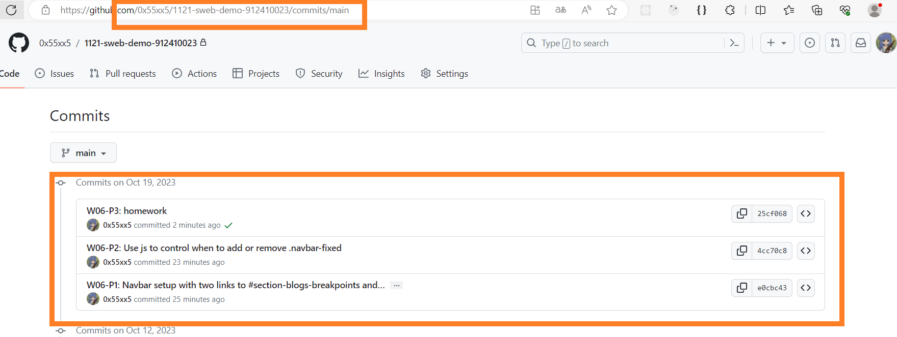

[My github repo url 912410023](https://github.com/0x55xx5)

[My Vercel url 912410023](https://1121-sweb-demo-912410023.vercel.app/)

#### 分支 MAIN

###

### W06-P1: Navbar setup with two links to #section-blogs-breakpoints and #section-blogs-minmix


```

e0cbc43 912410023       Thu Oct 19 21:05:03 2023 +0800  W06-P1: Navbar setup with two links to #section-blogs-breakpoints and #section-blogs-minmix
```

### W06-P2: W06-P2: Use js to control when to add or remove .navbar-fixed


```
e0cbc43 912410023       Thu Oct 19 21:05:03 2023 +0800  W06-P1: Navbar setup with two links to #section-blogs-breakpoints and #section-blogs-minmix

```

### W06-P3: Homework


```
25cf068 912410023       Thu Oct 19 21:27:11 2023 +0800  W06-P3: homework

```

### W06-P4: gitlogs



```
$  git log --pretty=format:"%h%x09%an%x09%ad%x09%s" --after="2023-10-18"

25cf068 912410023       Thu Oct 19 21:27:11 2023 +0800  W06-P3: homework
4cc70c8 912410023       Thu Oct 19 21:06:58 2023 +0800  W06-P2: Use js to control when to add or remove .navbar-fixed
e0cbc43 912410023       Thu Oct 19 21:05:03 2023 +0800  W06-P1: Navbar setup with two links to #section-blogs-breakpoints and #section-blogs-minmix

```

### 本週學習 用 anchor 在 index.html 與 index2.html 錨點跳換

可以看看 breakpoint 跟 minmax
