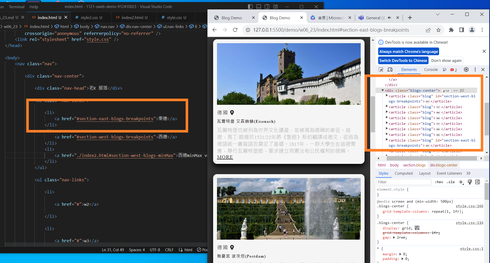
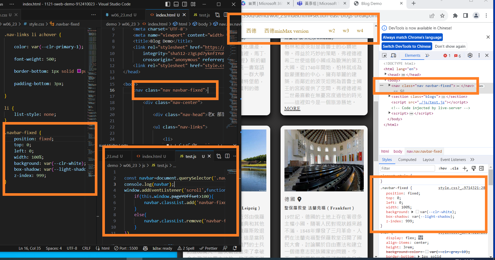
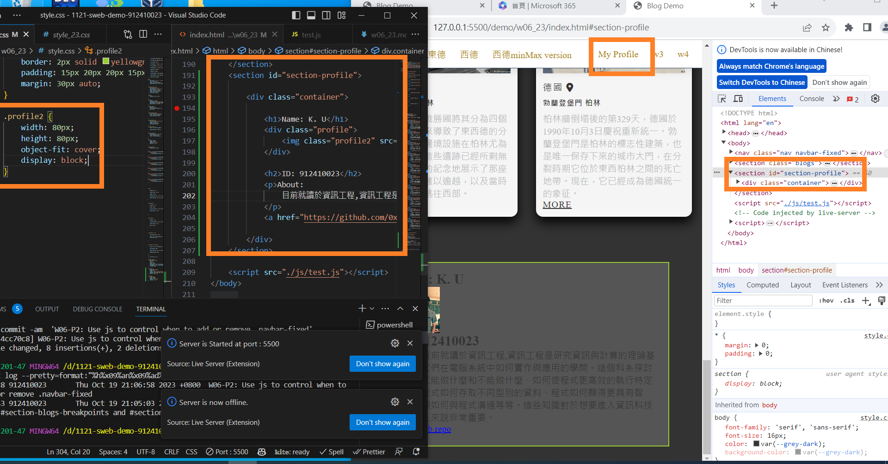

[My github repo url 912410023](https://github.com/0x55xx5)

[My Vercel url 912410023](https://1121-sweb-demo-912410023.vercel.app/)

#### 分支 MAIN

###

### W06-P1: Navbar setup with two links to #section-blogs-breakpoints and #section-blogs-minmix



```

e0cbc43 912410023       Thu Oct 19 21:05:03 2023 +0800  W06-P1: Navbar setup with two links to #section-blogs-breakpoints and #section-blogs-minmix
```

### W06-P2: W06-P2: Use js to control when to add or remove .navbar-fixed



```
e0cbc43 912410023       Thu Oct 19 21:05:03 2023 +0800  W06-P1: Navbar setup with two links to #section-blogs-breakpoints and #section-blogs-minmix

```


