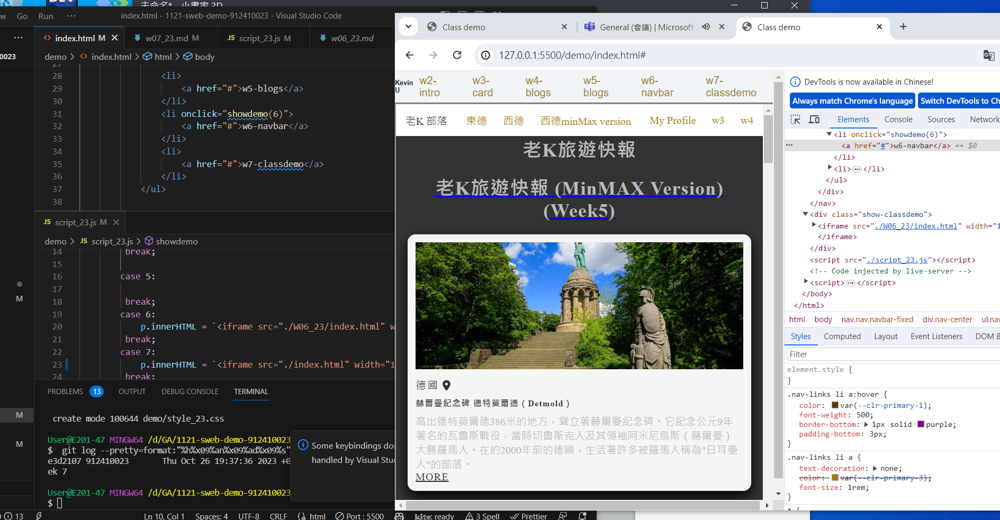

[My github repo url 912410023](https://github.com/0x55xx5)

[My Vercel url 912410023](https://1121-sweb-demo-912410023.vercel.app/)

#### 分支 MAIN

###

### ### W07-P1: Show classdemo of week 2 and week 7


```
e3d2107 912410023       Thu Oct 26 19:37:36 2023 +0800  W07-P1: Show classdemo of week 2 and week 7
```

### Week 6: Show week 6



```
e0b6d67 912410023       Thu Oct 26 19:48:23 2023 +0800  W07-P2: Show classdemo of week 7
```

### W07-P2: Show classdemo of week 7


```
e0b6d67 912410023       Thu Oct 26 19:48:23 2023 +0800  W07-P2: Show classdemo of week 7
```

### W07-P3: add index.html as home page with links of class demo, my Github and my Vercel


```
483744b 912410023       Thu Oct 26 20:25:00 2023 +0800  W07-P3: add index.html as home page with links of class demo, my Github and my Vercel

```
### W07-P4:  TILES LAYOUT


```
d126f79 0x55xx5 Fri Oct 27 21:56:23 2023 +0800  ### W07-P4:  TILES LAYOUT### W07-P4:  TILES LAYOUT
```


### W07-P5:  git logs

```
d126f79 0x55xx5 Fri Oct 27 21:56:23 2023 +0800  ### W07-P4:  TILES LAYOUT### W07-P4:  TILES LAYOUT
bdae10f 912410023       Thu Oct 26 21:45:22 2023 +0800  tiles
86cd4c5 912410023       Thu Oct 26 20:53:39 2023 +0800  update
9d97fd3 912410023       Thu Oct 26 20:50:26 2023 +0800  update
f8c5914 912410023       Thu Oct 26 20:37:22 2023 +0800  update
65f2b43 912410023       Thu Oct 26 20:25:54 2023 +0800  add pic
483744b 912410023       Thu Oct 26 20:25:00 2023 +0800  W07-P3: add index.html as home page with links of class demo, my Github and my Vercel
0a50650 912410023       Thu Oct 26 19:52:23 2023 +0800  minior mod
e0b6d67 912410023       Thu Oct 26 19:48:23 2023 +0800  W07-P2: Show classdemo of week 7
cf13fbf 912410023       Thu Oct 26 19:48:15 2023 +0800  W07-P2: Show classdemo of week 7
e3d2107 912410023       Thu Oct 26 19:37:36 2023 +0800  W07-P1: Show classdemo of week 2 and week 7
```