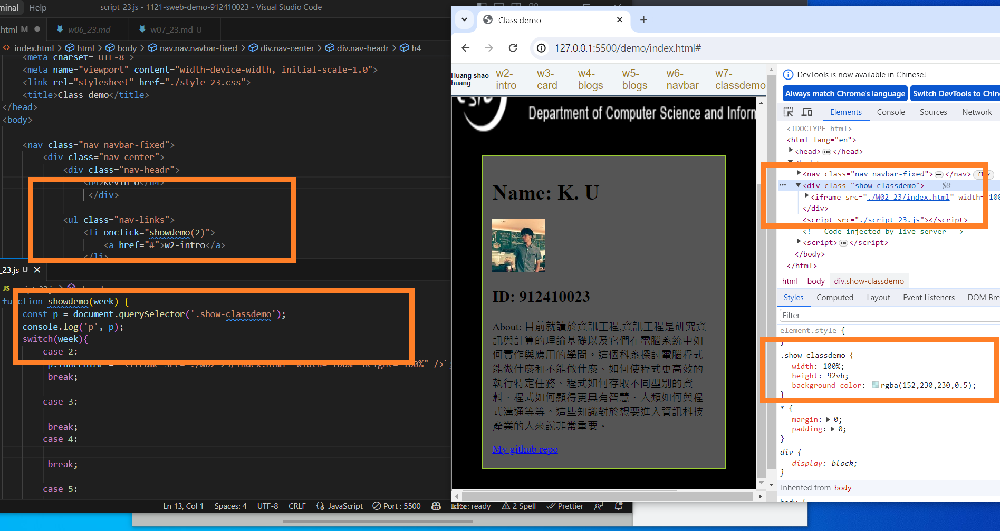
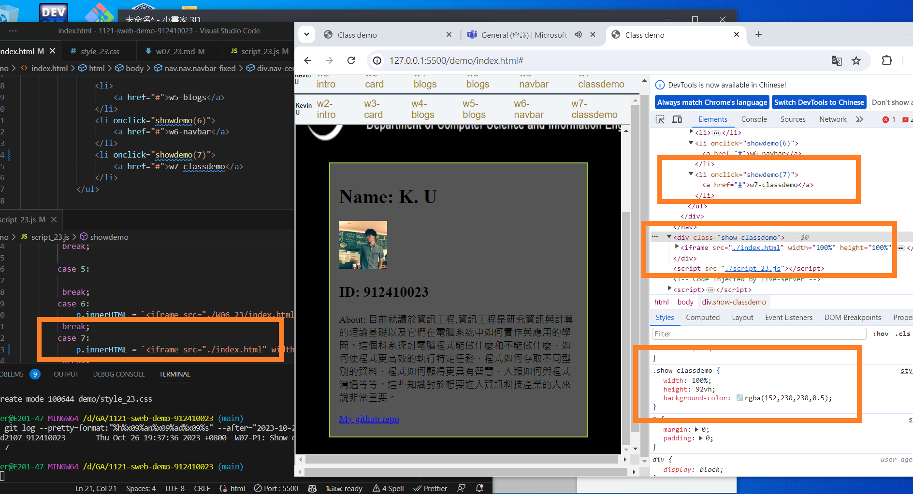
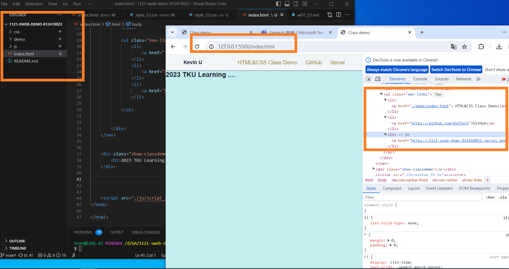

[My github repo url 912410023](https://github.com/0x55xx5)

[My Vercel url 912410023](https://1121-sweb-demo-912410023.vercel.app/)

#### 分支 MAIN

###

### ### W07-P1: Show classdemo of week 2 and week 7



```
e3d2107 912410023       Thu Oct 26 19:37:36 2023 +0800  W07-P1: Show classdemo of week 2 and week 7
```

### Week 6: Show week 6


```
e0b6d67 912410023       Thu Oct 26 19:48:23 2023 +0800  W07-P2: Show classdemo of week 7
```

### W07-P2: Show classdemo of week 7



```
e0b6d67 912410023       Thu Oct 26 19:48:23 2023 +0800  W07-P2: Show classdemo of week 7
```

### W07-P3: add index.html as home page with links of class demo, my Github and my Vercel



```
483744b 912410023       Thu Oct 26 20:25:00 2023 +0800  W07-P3: add index.html as home page with links of class demo, my Github and my Vercel

```
### W07-P4:  TILES LAYOUT

