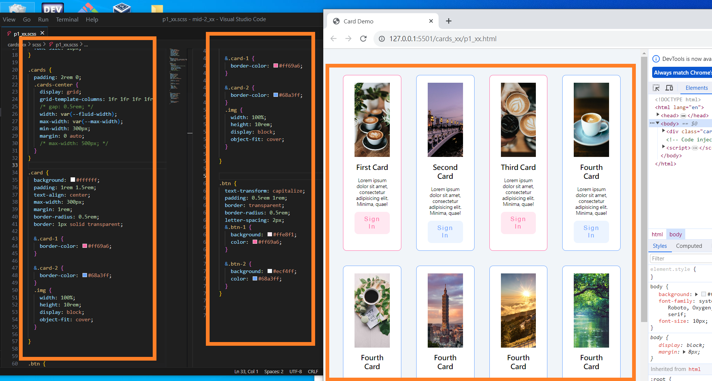
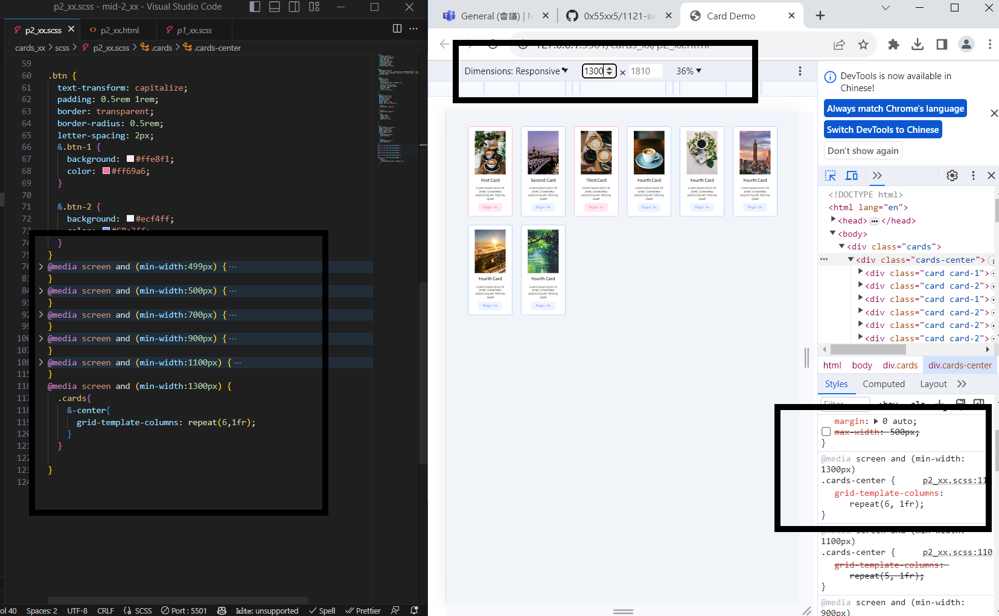
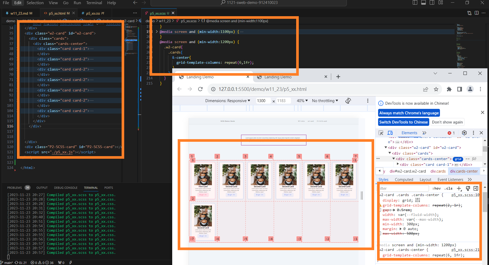
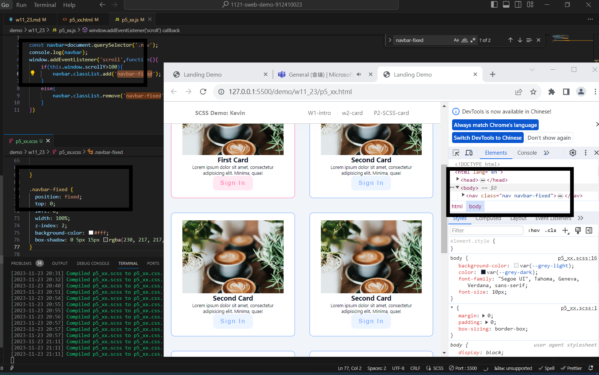
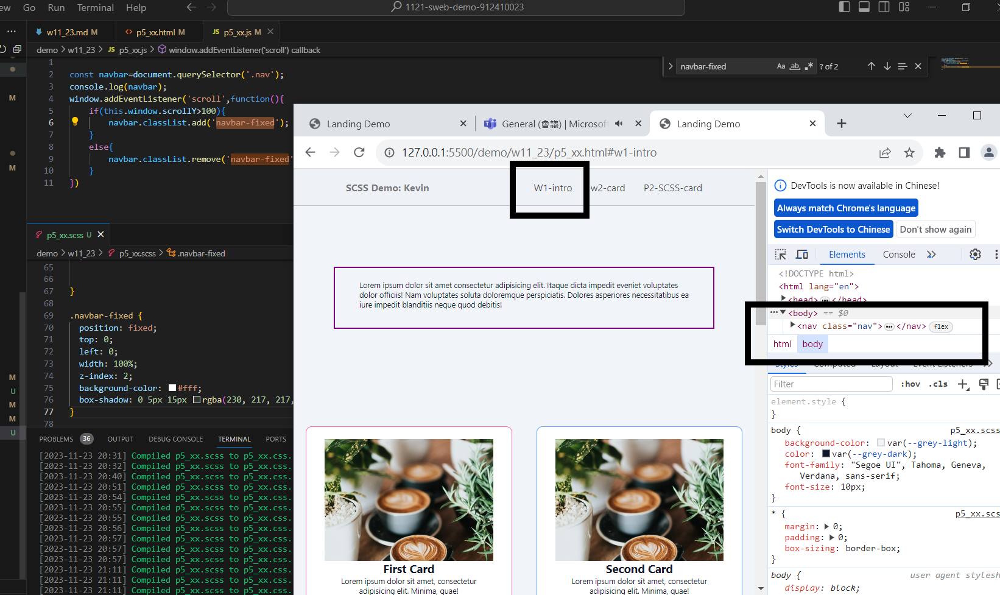
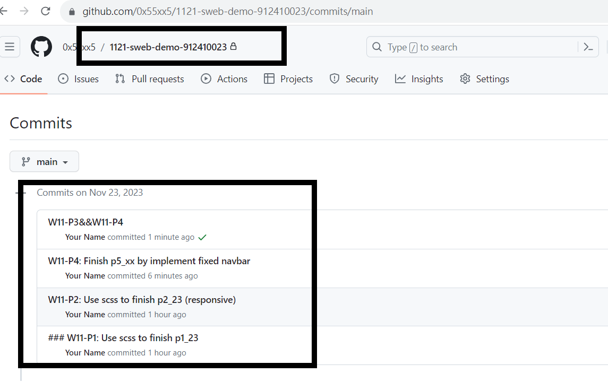

[My github repo url 912410023](https://github.com/0x55xx5)

[My Vercel url 912410023](https://1121-sweb-demo-912410023.vercel.app/)

### W11-P1: Use scss to finish p1_23



```
a89a54a Your Name       Thu Nov 23 20:09:03 2023 +0800  ### W11-P1: Use scss to finish p1_23
```

### W11-P2: Use scss to finish p2_23 (responsive)



```
0a21333 Your Name       Thu Nov 23 20:09:41 2023 +0800  W11-P2: Use scss to finish p2_23 (responsive)
```


### W11-P3: Finish p5_23 by adding content in P2



### W11-P4: Finish p5_23 by implement fixed navbar





### W11-P5: W11 git logs



```
bd086dd Your Name       Thu Nov 23 21:22:28 2023 +0800  W11-P3&&W11-P4
7464bbb Your Name       Thu Nov 23 21:18:02 2023 +0800  W11-P4: Finish p5_xx by implement fixed navbar
0a21333 Your Name       Thu Nov 23 20:09:41 2023 +0800  W11-P2: Use scss to finish p2_23 (responsive)
a89a54a Your Name       Thu Nov 23 20:09:03 2023 +0800  ### W11-P1: Use scss to finish p1_23
```
