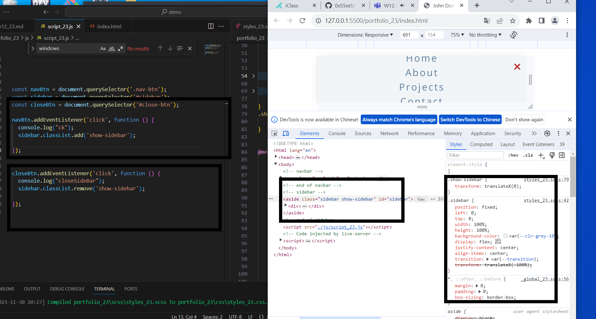

[My github repo url 912410023](https://github.com/0x55xx5)

[My Vercel url 912410023](https://1121-sweb-demo-912410023.vercel.app/)

Video: ### W12-P1: Create menu bar with nav links missing


```
45244ae Kevin   Thu Nov 30 20:40:18 2023 +0800  W12-P1: Create menu bar with nav links missing

```

Video: ### W12-P2: Show nav-links when the screen is greater than 768px


```
45244ae Kevin   Thu Nov 30 20:40:18 2023 +0800  W12-P1: Create menu bar with nav links missing
```

Video: ### W12-P3: Create sidebar by pressing nav-btn, remove sidebar by pressing close-btn




js 事件

```
45244ae Kevin   Thu Nov 30 20:40:18 2023 +0800  W12-P1: Create menu bar with nav links missing
```

Video: ### W12-P4: Make nav-btn and close-btn works with navbar-fixed and show-sidebar


```
856f8d7 Kevin   Thu Nov 30 21:22:53 2023 +0800  W12-P4: Make nav-btn and close-btn works with navbar-fixed and show-sidebar

```

### W12-P5: Create five social icons in sidebar section


```

```
