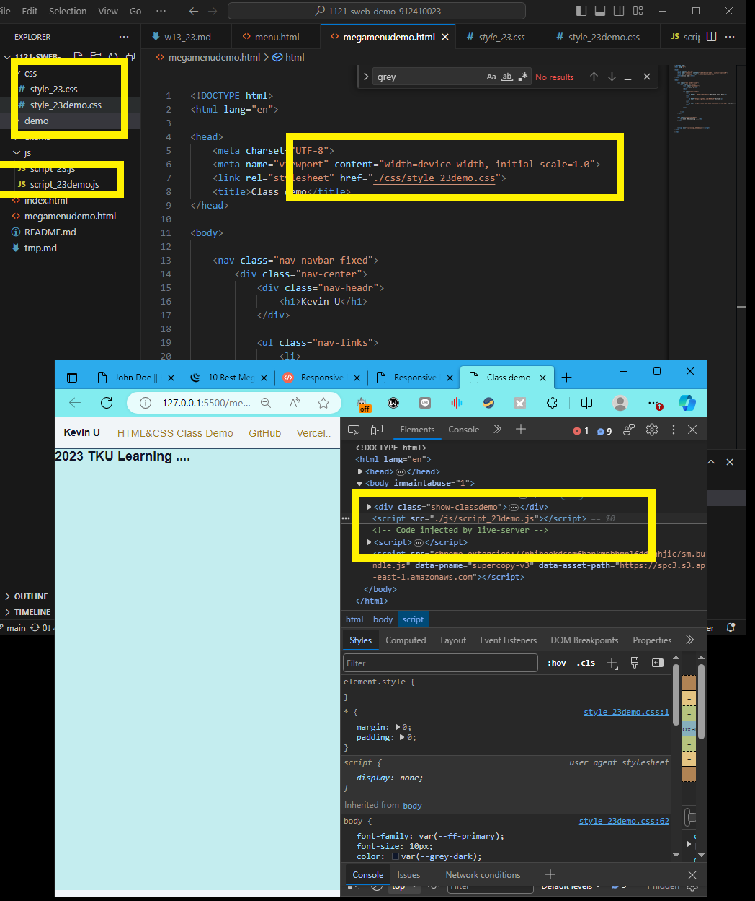

[My github repo url 912410023](https://github.com/0x55xx5)

[My Vercel url 912410023](https://1121-sweb-demo-912410023.vercel.app/)

### W13-P1: Do hero section using grid of 2 columns


```
b089740 0x55xx5 Thu Dec 7 20:48:16 2023 +0800   W13-P1: Do hero section using grid of 2 columns

```

### W13-P2: Do about section


```
a422cb9 0x55xx5 Thu Dec 7 21:25:21 2023 +0800   W13-P2: Do about section
```


 ### W13-P3: Do footer section

```
7b97700 0x55xx5 Thu Dec 7 22:14:39 2023 +0800   ### W13-P3: Do footer section
```

Video: 
### W13-P4: Change index.html to demo.html in the root page
 

 
```
c835c13 0x55xx5 Thu Dec 7 22:32:46 2023 +0800   ### W13-P4: Change index.html to demo.html in the root page
```


 ### W13-P5: Use mega menu theme to show w03-card page

```

```

