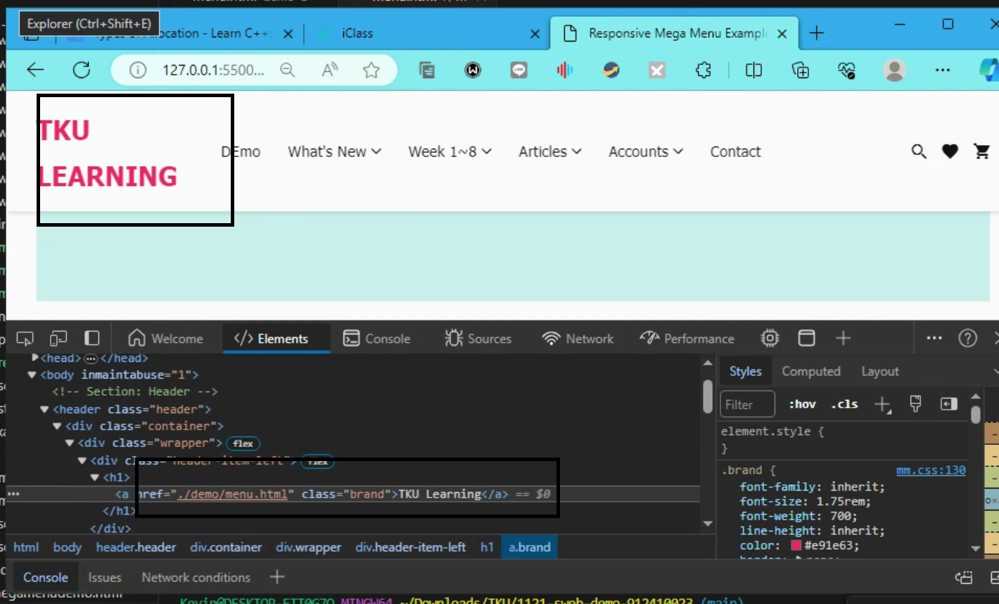

[My github repo url 912410023](https://github.com/0x55xx5)

[My Vercel url 912410023](https://1121-sweb-demo-912410023.vercel.app/)

### w14-P1: Link from homepage to class demo page, and link back to homepage




```
b089740 0x55xx5 Thu Dec 7 20:48:16 2023 +0800   w14-P1: Do hero section using grid of 2 columns

```

### w14-P2: Do about section


```
a422cb9 0x55xx5 Thu Dec 7 21:25:21 2023 +0800   w14-P2: Do about section
```


 ### w14-P3: Do footer section

```
7b97700 0x55xx5 Thu Dec 7 22:14:39 2023 +0800   ### w14-P3: Do footer section
```

Video: 
### w14-P4: Change index.html to demo.html in the root page
 

 
```
c835c13 0x55xx5 Thu Dec 7 22:32:46 2023 +0800   ### w14-P4: Change index.html to demo.html in the root page
```


 ### w14-P5: Use mega menu theme to show w03-card page

```
8ff1042 0x55xx5 Thu Dec 7 23:24:09 2023 +0800   w14-P5: Use mega menu theme to show w03-card page
```

 ### w14-P6: git  logs
 ```
 
 
 ```

