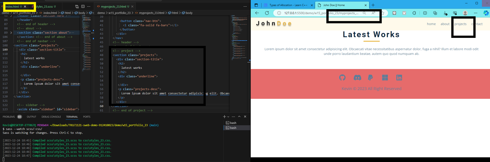
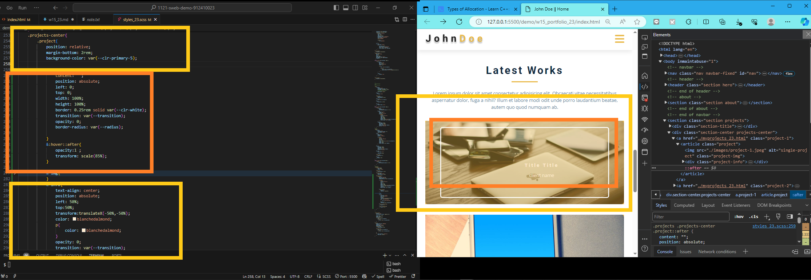
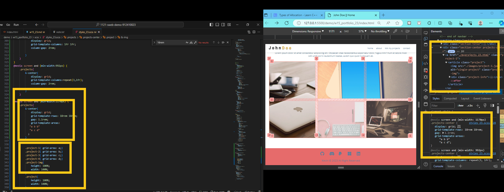
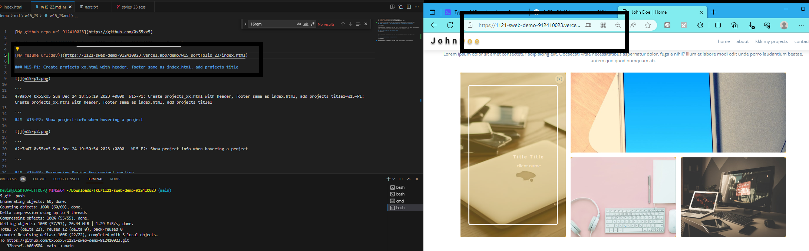

[My github repo url 912410023](https://github.com/0x55xx5)

[My Vercel url 912410023](https://1121-sweb-demo-912410023.vercel.app/)

[My resume url(dev)](https://1121-sweb-demo-912410023.vercel.app/demo/w15_portfolio_23/index.html)

### W15-P1: Create projects_xx.html with header, footer same as index.html, add projects title



```
470ab74 0x55xx5 Sun Dec 24 18:55:19 2023 +0800  W15-P1: Create projects_xx.html with header, footer same as index.html, add projects title1~W15-P1: Create projects_xx.html with header, footer same as index.html, add projects title1

```
###  W15-P2: Show project-info when hovering a project



```
d2e7a47 0x55xx5 Sun Dec 24 19:50:54 2023 +0800   W15-P2: Show project-info when hovering a project

```

###  W15-P3: Responsive Design for project section





```
b06b584 0x55xx5 Sun Dec 24 20:40:29 2023 +0800  W15-P3: Responsive Design for project section

```

### git logs
```
b06b584 0x55xx5 Sun Dec 24 20:40:29 2023 +0800  W15-P3: Responsive Design for project section
d2e7a47 0x55xx5 Sun Dec 24 19:50:54 2023 +0800   W15-P2: Show project-info when hovering a project
470ab74 0x55xx5 Sun Dec 24 18:55:19 2023 +0800  W15-P1: Create projects_xx.html with header, footer same as index.html, add projects title1~W15-P1: Create projects_xx.html with header, footer same as index.html, add projects title1

```